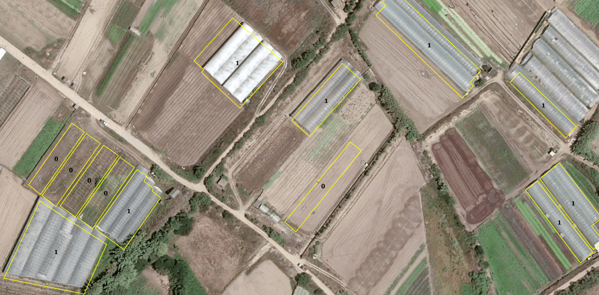
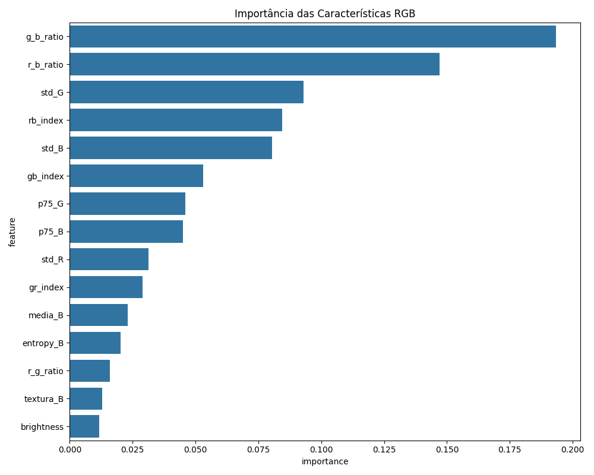
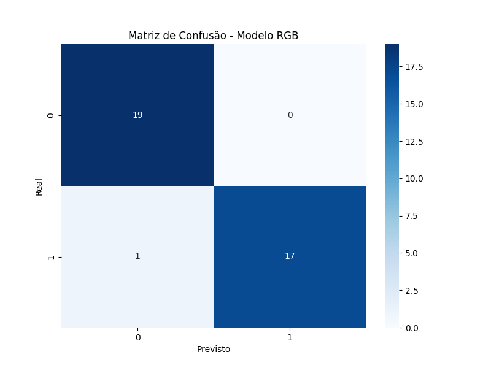

# Verifying a greenhouse registry with machine learning
### Automated validation of GIS-registered greenhouses against current imagery · Esposende – Vila do Conde Vulnerable Zone, Portugal

> Classical machine learning (Random Forest / Gradient Boosting) on
> RGB-derived spectral and textural features to verify, polygon by polygon,
> whether greenhouses registered in a GIS platform since 2013 still exist on
> the ground — with a confidence probability for every decision.

---

*Registry polygons classified by the model over DGT ortoSat2023 imagery — greenhouse confirmed (1); no longer present (0).*

*Random Forest feature importance — blue-band ratios dominate, consistent with greenhouse plastic reflectance.*

*Held-out test set: 36 of 37 polygons correctly classified.*

## Why verify

Since 2013, the teams monitoring the Esposende–Vila do Conde Vulnerable Zone (*Zona Vulnerável*, ZV1) have been mapping greenhouse polygons in a dedicated GIS platform (SIA-ZV), based on interviews with farmers. However, there has never been a systematic updating effort, either in the field or at the desk, because it is time-consuming and costly. A decade later, the registry and the territory had visibly diverged, with structures demolished, replaced, extended or newly built.

An outdated registry undermines everything built on top of it: pressure mapping, compliance checks, and the cross-referencing of nitrate monitoring data. Yet re-surveying hundreds of polygons manually was precisely the cost the institution could not afford. The task called for an automated method to validate the existence of each registered greenhouse efficiently.

## The approach

For each registered polygon, the method extracts a rich statistical
signature from current high-resolution RGB orthoimagery and trains a
classifier to decide: *is there still a greenhouse here?* The pipeline —
`verify_greenhouses.py` — runs end to end:

### 1. Feature engineering (the heart of the method)

Working with RGB only (no near-infrared band) demands creativity: the
script extracts **~40 features per polygon**, designed to capture what makes
greenhouse plastic distinctive:

- **Per-band statistics** — mean and robust percentiles (25th/75th) for R,
  G, B;
- **Texture** — mean absolute horizontal/vertical gradients per band
  (greenhouse roofs are locally smooth but strongly structured);
- **Entropy per band** — histogram-based complexity measure;
- **RGB-only vegetation/colour indices** — Excess Green (ExG), Excess
  Green minus Excess Red (ExGR), VARI, and normalised G–R, G–B, R–B
  indices: standard substitutes for NDVI when no NIR band is available;
- **Global colour descriptors** — brightness, saturation, dominant
  channel, inter-band ratios;
- **Geometric descriptors** — area, perimeter, compactness (4πA/P²) and
  perimeter/area ratio: greenhouses are elongated, regular structures,
  and shape carries signal that spectra alone miss.

### 2. Preprocessing and class balance

- Missing values imputed with **KNN imputation** (5 neighbours) rather
  than simple means — preserving local feature structure;
- **Robust scaling** (median/IQR), insensitive to the outliers that
  spectral statistics inevitably produce;
- **SMOTE oversampling applied conditionally** when the confirmed/absent
  class ratio falls below 0.7 — the honest scenario for a registry where
  most entries are still valid.

### 3. Automatic feature selection

A Random Forest ranks feature importance; the most informative subset feeds
the model comparison, reducing noise and overfitting risk.

### 4. Model comparison and tuning

Random Forest and Gradient Boosting are tuned with **grid search over
stratified 5-fold cross-validation**. The best performer is selected on
held-out data (25% test split) and reported with accuracy, AUC-ROC and
full classification metrics.

### 5. Output

For every registered polygon, the model produces:

- a **binary classification** — greenhouse present (1) or absent (0);
- an associated **confidence probability**, so that field verification can
  be *targeted*: high-confidence decisions are accepted, low-confidence
  polygons go on the short list for inspection.

The result is written back as a georeferenced layer, ready for the SIA-ZV
updating workflow.

## Results

On a GIS-validated ground truth, the tuned **Random Forest** was selected
over Gradient Boosting, using just **9 features** after automatic
selection — dominated by blue-band relationships (`g_b_ratio`,
`r_b_ratio`, `rb_index`, `std_B`), consistent with the strong blue
reflectance of greenhouse plastic:

| Metric | Value |
|---|---|
| Test accuracy | **97.3 %** |
| Cross-validation accuracy | 94.5 % ± 3.5 % |
| AUC-ROC | 0.977 |
| Polygons assessed | 1,792 (1,786 with valid imagery) |

Applied to the full registry, the model found that **only about 70 % of
the greenhouses registered since 2013 are still active** — quantifying,
for the first time, the registry's drift from reality and delivering a
prioritised list for its update.

## Why it matters

- **Registry maintenance at a fraction of the cost** — instead of
  re-surveying every polygon, field effort concentrates on the small subset
  where the model is uncertain;
- **A repeatable audit** — the method can be re-run on every new imagery
  campaign (e.g. each DGT orthoimagery release), turning registry
  validation from a one-off project into a routine;
- **Complementary to detection** — together with the
  [U-Net greenhouse detection](https://github.com/LFilipePacheco/greenhouse-detection-unet)
  project, it closes the loop: detection finds structures missing from the
  registers; verification flags registered structures missing from the
  ground.

## Repository contents

| File | Purpose |
|---|---|
| `verify_greenhouses.py` | Full pipeline: feature extraction from imagery, preprocessing, feature selection, model comparison and tuning, per-polygon classification with probabilities |
| `requirements.txt` | Python dependencies |

Paths in the script are placeholders (`path/to/...`) — point them at your
polygon layer (with a `Confirmado` ground-truth field), your RGB
orthoimagery and an output folder.

## Stack

Python · scikit-learn · imbalanced-learn (SMOTE) · GeoPandas · rasterio ·
pandas · seaborn · DGT ortoSat2023 orthoimagery (open WMS, Direção-Geral
do Território)

## About the data

The greenhouse registry (SIA-ZV), the ground-truth labels and the
verification results are institutional property of CCDR-Norte, I.P. and are
not published here. The imagery is the open ortoSat2023 service of the
Direção-Geral do Território (DGT). The code is shared as a working
reference implementation.

---

**Luís Filipe Pacheco** — Senior Engineer & Data Scientist,
CCDR-Norte, I.P. · [GitHub profile](https://github.com/LFilipePacheco) ·
[LinkedIn](https://www.linkedin.com/in/lu%C3%ADs-filipe-pacheco-471495b/) ·
[ORCID](https://orcid.org/0009-0001-7676-6542)
